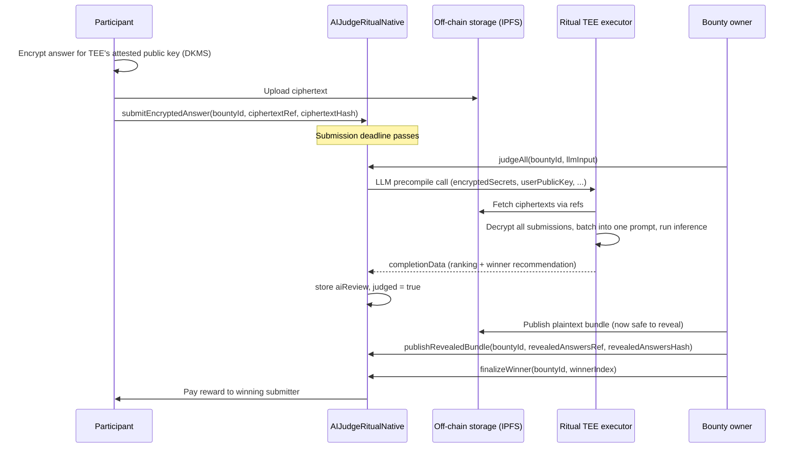

# Architecture Note: Commit-Reveal vs. Ritual-Native Hidden Submissions

## 1. Two ways to hide an answer

Both tracks solve the same problem — stop participant N from reading
participants 1..N-1's answers before judging — but they hide the secret in
different places and for different durations.

| | **Required: Commit-Reveal** | **Advanced: Ritual-Native** |
|---|---|---|
| What goes on-chain during submission | A hash commitment | A pointer + hash to an off-chain ciphertext |
| When does plaintext ever touch the chain | Yes — during the reveal phase, before judging | Never |
| Who can decrypt/read an answer, and when | Anyone, once revealed (a normal calldata read) | Only the TEE executor, only transiently, only during `judgeAll()` |
| Extra infrastructure required | None — works on any EVM chain | Ritual TEE executor + DKMS-managed keys |
| Gas cost per submission | One `bytes32` hash + later a `string` reveal | One `bytes32` hash + a short ref string; no plaintext ever stored |
| What this homework actually implements | Full contract + 23 passing tests | Design sketch (`AIJudgeRitualNative.sol`, compiles, not unit-tested) |

The required track still has a real, if short, exposure window: once
someone reveals, their answer is public for the rest of the reveal phase,
in case a competitor is still deciding whether to reveal at all (they
already locked in their commitment, so they can't *change* their answer in
response, but they could see it before deciding to reveal their own — a
much weaker version of the original bug, bounded to the reveal window
instead of the whole submission window). The advanced track is the fix for
*that* residual gap: nobody, ever, sees plaintext outside the TEE.

## 2. Advanced track design requirements

### Where do plaintext answers exist, and who can read them?

Only inside the Ritual TEE executor's enclave memory, and only for the
duration of the single `judgeAll()` inference call. Participants encrypt
their answer off-chain for the executor's attested public key (obtained via
the DKMS precompile flow, address `0x081B` in `PrecompileConsumer.sol`)
before ever submitting anything. The contract, the block builder, other
participants, and the bounty owner never see plaintext — the owner only
ever sees the AI's aggregate judgment (`aiReview`), not the underlying
answers, until the reveal step described below.

### What's stored on-chain vs. off-chain?

- **On-chain:** a `bytes32 ciphertextHash` per submission (commits to the
  encrypted blob), a `string ciphertextRef` pointing at where that blob
  lives off-chain, the AI's judgment bytes (`aiReview`), and — after
  judging — a `revealedAnswersRef` + `revealedAnswersHash` pair committing
  to the final plaintext bundle.
- **Off-chain:** the actual ciphertext blobs (e.g. on IPFS), and, after
  judging, the plaintext answer bundle itself.

This deliberately avoids ever putting a full plaintext (or even a full
ciphertext) answer directly into contract storage. `MAX_ANSWER_LENGTH` in
the required track (2,000 bytes) is cheap enough to store directly; once
that grows — multi-paragraph answers, code, images — the gas cost of
storing it in `SSTORE`s stops being justifiable, and a content-addressed
reference plus a hash commitment is the standard way to keep the *content*
off-chain while keeping the *integrity guarantee* on-chain.

### How does the LLM receive all submissions together?

The same way the required track does: one call to the LLM precompile
(`0x0802`) per bounty, never a loop with one call per submission. The
difference is entirely in how `llmInput` is built off-chain — it populates
the precompile's `encryptedSecrets` / `userPublicKey` fields (already
present in the ABI layout the workshop's frontend uses, see
`web/src/lib/ritualLlm.ts`) so the TEE executor decrypts every submission's
ciphertext as part of servicing that one request, assembles all the
plaintexts into a single prompt internally, and returns one combined
ranking — structurally identical to the required track's `aiReview`, just
computed over data nobody outside the enclave ever saw.

### How does the final reveal happen, and how does the contract commit to it?

After `judgeAll()` succeeds, `publishRevealedBundle(bountyId, ref, hash)`
records a reference to the now-decrypted plaintext bundle (uploaded
off-chain, e.g. by the owner or an automated job watching for the
`AllAnswersJudged` event) plus `keccak256` of that bundle. Anyone can fetch
the bundle from `ref` and independently check it hashes to
`revealedAnswersHash` — the same hash-commitment idea the required track
uses per-answer, just applied once to the whole bundle instead of N times.
`finalizeWinner()` refuses to run until this hash has been set
(`"revealed bundle not published yet"`), so a winner can never be chosen
from data that was never made independently verifiable.

### Why not just store everything on-chain?

`MAX_SUBMISSIONS` × a few KB of ciphertext per answer adds up fast in
`SSTORE` cost, and there's no benefit to it: nobody needs to read
ciphertext directly from a contract getter, they need to either (a) verify
a hash, which a 32-byte commitment already gives them, or (b) fetch and
decrypt the actual bytes, which only the TEE can do anyway. Storing the
blob on-chain would just be an expensive way to store something the chain
itself can't use.

## 3. Sequence diagram — advanced track

## 4. Ritual feature checklist

- **TEE-backed execution** — judging plaintext only ever exists inside the
  executor's enclave, never in contract storage or calldata.
- **Encrypted inputs/secrets** — submissions are ciphertext end-to-end on
  the public chain; the `encryptedSecrets`/`userPublicKey` precompile
  fields are how the executor gets the key material it needs to decrypt
  them.
- **Batch judging** — one `judgeAll()` call per bounty in both tracks,
  never one LLM call per submission.
- **Human-in-the-loop finalization** — in both contracts, `aiReview` is
  advisory. `finalizeWinner()` always takes an explicit `winnerIndex` from
  the owner; nothing about the AI's output moves funds by itself.
